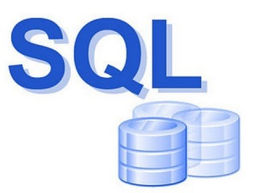
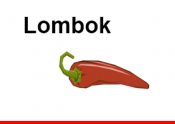

### Hi there 👋

<!--
**AleksandrIsa4/AleksandrIsa4** is a ✨ _special_ ✨ repository because its `README.md` (this file) appears on your GitHub profile.

Here are some ideas to get you started:

- 🔭 I’m currently working on ...
- 🌱 I’m currently learning ...
- 👯 I’m looking to collaborate on ...
- 🤔 I’m looking for help with ...
- 💬 Ask me about ...
- 📫 How to reach me: ...
- 😄 Pronouns: ...
- ⚡ Fun fact: ...
-->

Привет! Я начинающий Java разработчик, который стремится создавать качественные программные продукты и повышать свой уровень. Моя цель - стать экспертом в разработке масштабируемых и надежных приложений на Java.

Мой стек технологий включает в себя:
  

  
  
  
  
  
  
  
  
  
  
  
  
  

  
  

Применил принципы ООП, SOLID, паттерны проектирования при разработке проектов:
- Task-manager - REST приложение на основе Java Core для организации совместной работы над задачами
- Filmorate - REST приложение для работы с базой фильмов и оценками пользователей
- ShareIt - REST приложение для аренды разных вещей
- Explore-with-me - REST приложение для организации событий и участия в них.

